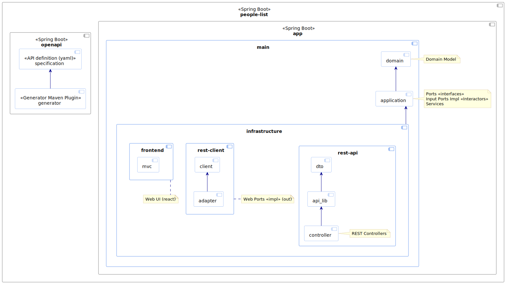

# swapi-challenge-web-application
Challenge for Consulting Company

## Use Case
[Challenge description](addons/docs/Software%20Engineer%20Quiz.pdf) \
The `swapi.co` is no longer available and i assume to use `swapi.info` 

## Methodology (Api first) 
- The methodology used in this project is called API First. This methodology is based on the idea that the API specification should be designed and implemented before the client-side application. This approach allows the development team to focus on the API first, and then build the client-side application around the API.

## Tech Stack
- Java 17 as language
- Cache in memory to improve the performance. In production is better to use distributed cache like Redis, Hazelcast, ...
- Spring Boot as Framework in the backend.

## Components
### Architecture
- The hexagonal architecture applied in this micro is:\
  
- The components applied in this micro are:\
    - `openapi` Api-specification following standards. The `dto's` & the `controller interface` are autogenerated on build phase.
    - `app` Micro-service implementation.
      
- The `@Interactor` (decorator) is useful to avoid the Spring Framework dependencies in the Application layer.
- The UI has been implemented using ReactJS.

## Run the Project
### from your local JVM
Then to run:
````./gradlew clean bootRun````

### from Docker
from CLI run this command:
````
docker-compose up
OR
docker compose up
````

## Testing
- The integration test is implemented into the class `StarwarsControllerIT`.
- Once the micro is running we can run a manual test using:
    - From terminal:
      - `curl http://localhost:8082/v1/people`
      - `curl http://localhost:8082/v1/starships`
    - From `ìntellij` using `http` feature. Go to folder `./addons/api-testing/http-samples` & click on the file (`http-requests.http`) with extension `http`.
    - From `postman` import the collection `./addons/api-testing/postman/Capitole-Challenge.postman_collection.json`. 
